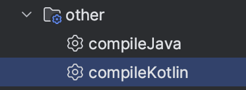
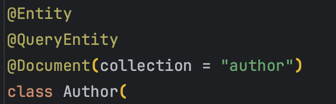
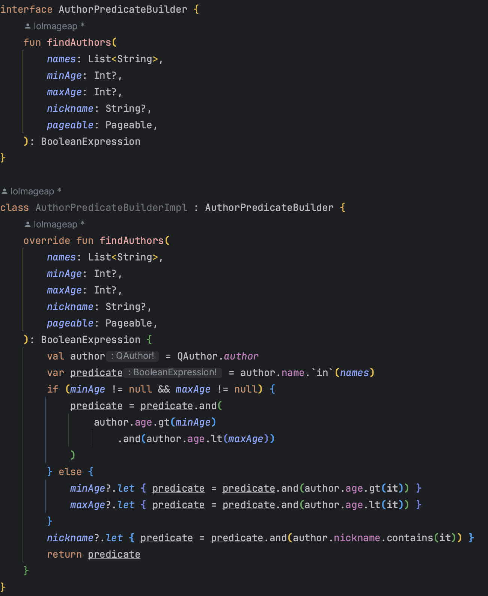
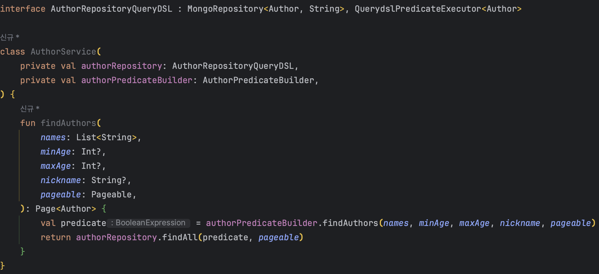
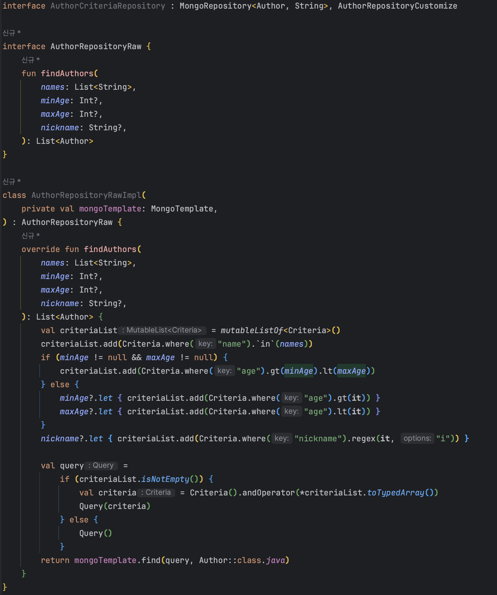
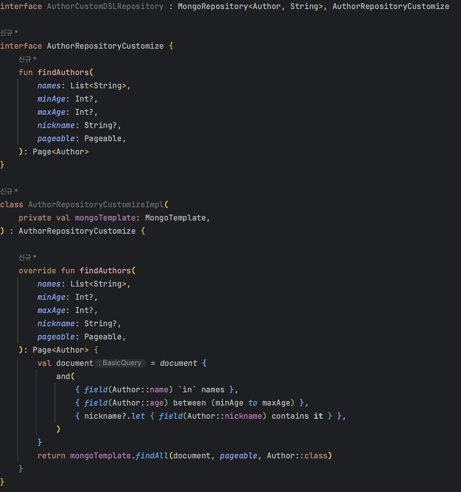

# 유스콘'24 발표자 오리엔테이션

## 시간 분배

- 자기 소개, 개요 5분
- 사용법 설명 10분
- 실습 30분
- Q&A 5분

## 사전 준비

- Mongo Atlas에 미리 데이터를 initialize한다.
- 사전에 미리 entity를 만들어 놓아야한다.(Author, Book)
- Test 코드를 작성할 수 있는 환경을 구축한다.

## 목차

- 자기 소개
- DSL을 만들게 된 계기
- MongoDB, DSL 정의에 대한 간단한 설명
- 기본적인 MongoDSL의 문법 학습
- 연산, 정렬, 통계 쿼리, 페이지 네이션, 동적 쿼리 등등 다양한 DSL을 작성하고 실행
- 회고 및 Q&A

## 발표자 소개

안녕하세요. **개선**하는 것을 좋아하는 2년차 개발자 **정철희**입니다.  
현재 **비유바움**이라는 회사에서 백엔드 개발자로 일하고 있으며 주로 **Kotlin**과 **Spring Boot, Ktor** 프레임워크를 사용하여 정산 서비스를 개발, 운영하고 있습니다.  
저는 **꾸준함**이라는 좋은 습관을 가지기 위해 퇴근 후에도 매일 코드를 작성하며 개선할 부분들을 찾아 리팩토링하는 것을 좋아합니다.  
오늘은 그 과정 중에 하나였던 'Kotlin Custom MongoDSL'에 대하여 발표를 진행할 예정입니다.

## 발표 주제 : Kotlin으로 맞춤형 Mongo DSL 개발

### 개요

저는 비유바움이라는 회사에서 정산 솔루션을 개발 할 때 결제 데이터는 MongoDB에 저장하여 관리하도록 설계하였습니다.  
기존에는 쿼리 빌더를 criteria와 queryDSL을 사용하려 했지만 개발 과정에서 여러 문제점이 나타났습니다.  
QueryDSL Mongo는 RDBMS에 비해 지원이 현저히 적었고 Criteria를 직접 사용하자니 타입 안정성과 가독성이 떨어진다는 문제가 있었습니다.  
그러던 와중 평소 dsl을 만들어보고 싶다는 생각이 겹쳐 직접 bson 기반으로 dsl을 만들게 되었습니다.  
많이 부족하지만 작은 도전이라고 생각하여 이렇게 유스콘에서 `kotlin mongodb dsl`을 주제로 발표하게 되었고 간단한 브리핑 이후에 같이 코드를 작성해보면서 발표를 진행하도록 하겠습니다.

### MongoDB란

MongoDB는 RDBMS와 다르게 Schemaless한 NoSQL 비관계형 데이터베이스입니다.  
MongoDB는 Document를 사용하여 데이터를 저장하며 Document는 JSON과 비슷한 형태인 BSON(Binary JSON) 형태로 저장됩니다.  
이러한 특징으로 인해 MongoDB는 RDBMS와 다르게 Join, Transaction 등의 기능이 부족하지만 대신 확장성이 뛰어나고 데이터를 저장, 조회 시 성능이 뛰어나다는 장점이 있습니다.

### DSL이란

DSL은 Domain Specific Language의 약자로 특정 도메인에 특화된 언어를 말합니다.  
제가 이번에 만들어본 MongoDB DSL은 MongoDB의 문법을 모르더라도 RDBMS의 ORM처럼 쉽게 사용하기 위해 Kotlin 문법으로 만든 MongoDB Domain Specific Language입니다.  
제가 사용한 언어인 Kotlin은 DSL을 만들기 유용한 언어입니다.  

### QueryDSL Mongo, Criteria API 와 비교

먼저 QueryDSL Mongo와 Criteria API를 소개하고 왜 이 두 라이브러리를 사용하지 않고 직접 DSL을 만들었는지에 대해 설명하겠습니다.   
예제로 사용할 코드는 Author Collection의 `name을 in 연산`, `nickname을 like 연산`, `age는 between 연산`하는 코드입니다.  

#### QueryDSL Mongo

QueryDSL Mongo는 많은 기능을 제공해주지만 설정이 복잡하고 레퍼런스가 생각보다 적었으며 Q파일 생성, 별도의 의존성을 추가해야 한다는 단점이 마음에 들지 않았습니다.  
또한 아주 복잡한 쿼리를 만들 때와 동적으로 쿼리를 만들 때 가독성이 떨어지기도 했습니다.  
QueryDSL Mongo는 predicate를 만들어서 재할당하는 방식을 사용하는데 불변성을 강조하는 Kotlin과 잘 어울리지 않다고 생각했습니다.

##### gradle 설정이 복잡함.


##### Q파일을 주기적으로 생성해야기 때문에 생산성이 떨어짐.


##### @Entity, @QueryEntity를 추가적으로 붙혀줘야함.


##### 구조 및 가독성이 떨어짐.



#### Criteria API

QueryDSL Mongo에 이런 문제들 때문에 Criteria API를 사용하려고 했습니다.  
Criteria API는 복잡한 연산을 아주 잘 지원해주지만 타입 안정성과 가독성이 떨어진다는 문제가 있었습니다.



#### MongoDB DSL

위 두 라이브러리를 사용하면서 느낀 단점들을 **개선**하고자 아래 예시처럼 직접 DSL을 구현했습니다.  
바로 위에서 소개했던 코드를 MongoDB DSL로 변환하면 아래와 같습니다.



### 사용법

DSL의 구조는 생각보다 정말 단순합니다.  
`document` 함수를 호출하면 `DocumentScope`가 생성되고 `DocumentScope` 내부에서 `and`, `or`, `not`, `nor` 함수를 호출하여 `Document`를 만들 수
있습니다.  
복잡한 조건 연산을 수행할 수 있게 `and`, `or`, `not`, `nor` 함수 내에서 또 다른 `and`, `or`, `not`, `nor` 함수를 호출할 수도 있습니다.  

#### 연산

```kotlin
@Test
fun `같은 값을 조회합니다.`() {
    document {
        and(
            { field(Author::name) eq "John" },
            { field(Author::age) eq 18 },
        )
    }
}

@Test
fun `같지 않은 값을 조회합니다.`() {
    document {
        and(
            { field(Author::name) ne "John" },
            { field(Author::age) ne 18 }
        )
    } 
}

@Test
fun `큰 값을 조회합니다`() {
    document {
        and(
            { field(Author::age) gt 18 },
        )
    }
}

@Test
fun `작은 값을 조회합니다`() {
    document {
        and(
            { field(YoungAuthor::age) lt 18 },
        )
    }
}

@Test
fun `사이에 있는 값을 조회합니다`() {
    document {
        and(
            { field(YoungAuthor::age) between (18 to 30) },
        )
    }
}

@Test
fun `값을 포함하면 조회합니다`() {
    document {
        and(
            { field(YoungAuthor::age) `in` listOf(18, 19, 20) },
        )
    }
}

@Test
fun `like 연산과 같이 문자열을 포함하면 조회합니다`() {
    document {
        and(
            { field(YoungAuthor::name) contains "John" },
        )
    }
}

@Test
fun `like 연산과 같지만 대소문자를 구별하지 않고 문자열을 포함하면 조회합니다`() {
    document {
        and(
            { field(YoungAuthor::name) containsIgnoreCase "John" },
        )
    }
}
```

#### 통계 쿼리 생성

grouping을 사용하면 sum, avg, min, max, count 등 다양한 통계 쿼리를 생성할 수 있습니다.  
아래 코드는 grouping 대상을 명시하진 않아 조건에 맞는 Author 나이의 전체 합을 구하는 코드입니다.

```kotlin
@Test
fun `전체에 대한 합을 구한다`() {
    val document = document {
        and(
            { field(YoungAuthor::name) eq "John" },
        )
    }

    val sumOfAge = mongoTemplate.sum(document, YoungAuthor::age)
    assert(sumOfAge == 100)
}
```

grouping을 명시하면 아래와 같이 group 별로 통계 쿼리를 생성할 수 있습니다.  
그리고 만약 mongodb collection에 field가 string 타입이어도 숫자로 형변환하여 계산하는 것도 가능합니다.

```kotlin
@Test
fun `grouping 된 필드에 대한 합을 구한다`() {
    val document = document {
        and(
            { field(YoungAuthor::name) eq "John" },
        )
    }

    val statusGroup = document.groupBy(YoungAuthor::status)
    val sumOfGroup = mongoTemplate.sum(statusGroup, YoungAuthor::age)
    assert(sumOfGroup == mapOf(ACTIVE to 90, INACTIVE to 10))
}
```

#### 정렬

정렬은 orderBy 함수를 사용하면 됩니다.

```kotlin
@Test
fun `다중 orderBy 정렬 테스트`() {
    val document = document {
        and(
            { field(YoungAuthor::name) eq "John" },
            { field(YoungAuthor::age) eq 18 },
        )
    }.orderBy(YoungAuthor::name).desc()
        .orderBy(YoungAuthor::age).asc()

    assert(document.sortObject == Document("name", -1).append("age", 1))
}
```

## Hands-On 실습

```
QueryDSL, Criteria로 작성된 before default 코드를 DSL로 리팩토링하는 방식으로 진행할 예정.  
간단한 연산(eq, in, like, gt, lt)을 사용하여 MongoDB를 조회 해볼 예정.  
정렬, 통계 쿼리(min, max, sum, count, avg), 페이지 네이션, 동적 쿼리를 생성해 볼 예정.  
```

## 마무리

저는 이번 DSL을 만들면서 MongoDB에 대한 이해도가 높아지고 Kotlin이라는 언어에 대한 이해도가 더 높아졌습니다.  
성장을 원하는 주니어 개발자라면 간단한 나만의 DSL을 만들어본다면 어떨까요?   